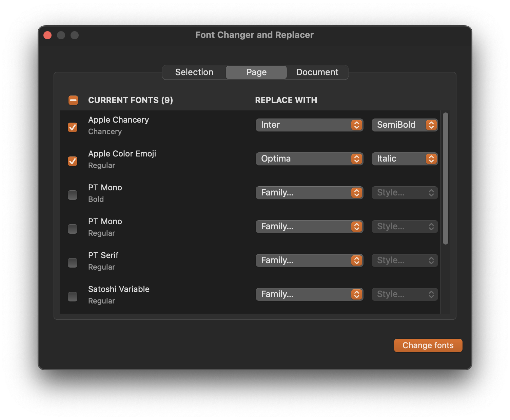

# Font Changer and Replacer

Replace one font with another across your selection, page or entire Sketch document.

## Features
- Quickly find and replace fonts in your designs.
- Works natively within Sketch.

## Installation

### Recommended (via Sketch Plugin Directory)
*Coming soon!*

### Manual Installation
1. Download the latest `font-replacer.sketchplugin.zip` from the [Releases](https://github.com/varundevpro/sketch-plugin-font-replacer/releases) page.
2. Unzip the downloaded file.
3. Double-click the `font-replacer.sketchplugin` file to install it in Sketch.

## Usage
1. Open Sketch.
2. Navigate to `Plugins` -> `Font Replacer Native` -> `Font Changer and Replacer`.
3. Use the interface to select the fonts you want to replace and apply changes!
